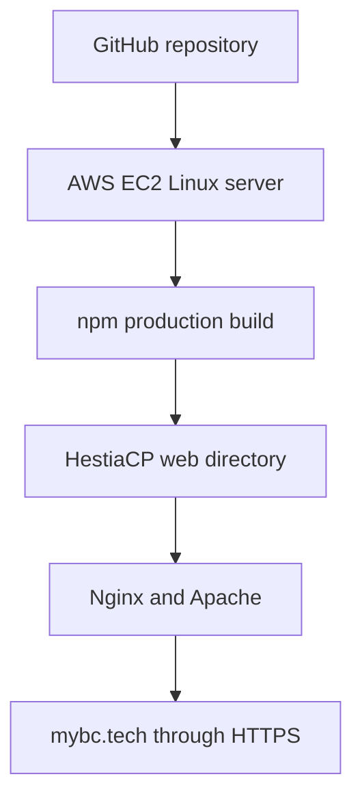

# Nabil Ajwad Rosedi — Developer Portfolio

A responsive React portfolio presenting my experience as a Senior Software
Engineer across AI, web, mobile, fintech, cloud, and Web3 development.

[Live website](https://mybc.tech) ·
[GitHub profile](https://github.com/cruzerblade95) ·
[LinkedIn](https://www.linkedin.com/in/nabil-ajwad-rosedi-4bbb621a2/)

## About Me

I am a Senior Software Engineer with more than five years of experience
building production-ready applications.

My core stack includes Flutter, Laravel, PHP, React, TypeScript, REST APIs,
Firebase, AWS, MySQL, and PostgreSQL.

My professional experience includes:

- Fintech platforms and secure payment features
- REST API development and third-party integrations
- Flutter applications released on Google Play and the Apple App Store
- Laravel enterprise systems and React single-page applications
- Blockchain integrations and smart-contract interactions
- AI-powered applications and reusable TypeScript developer tools
- AWS deployment and Linux server administration
- DNS, HTTPS, Nginx, Apache, HestiaCP, cPanel, WHM, and Plesk

## Featured Projects

| Project | Highlights | Technologies |
| --- | --- | --- |
| [AI Client SDK](https://github.com/cruzerblade95/ai-client) | Provider-agnostic AI SDK published as [`@cruzerblade95/ai-client`](https://www.npmjs.com/package/@cruzerblade95/ai-client) | TypeScript, AWS Bedrock, OpenAI, Anthropic, Vitest |
| [Web3 AI Portfolio](https://github.com/cruzerblade95/web3-ai-portfolio) | Multi-chain portfolio analytics with generative AI insights | React, TypeScript, AWS, Bedrock, Web3 |
| [E-DA Wallet](https://github.com/cruzerblade95/E-DA-User-App) | Wallet management, QR payments, transaction history, and secure APIs | Flutter, Laravel, MySQL, REST API |
| Penang Smart Kariah | Production community application released on Google Play and the Apple App Store | Flutter, Firebase, REST API |
| [SPB MAINPP](https://mims.mainpp.gov.my/) | Integrated management system supporting organizational workflows | Laravel, PHP, MySQL, JavaScript |
| [AWS Portfolio](https://github.com/cruzerblade95/cruzerblade95_portfolio) | Self-managed production deployment with a custom domain and HTTPS | React, AWS EC2, Linux, HestiaCP, Nginx |

## Professional Experience

### Senior Software Engineer

**Megah Fintech Sdn. Bhd.**  
January 2025 – June 2026

- Led the development of fintech features
- Designed secure payment-related functionality and REST APIs
- Worked on blockchain integrations and smart-contract interactions
- Contributed to architecture planning and code reviews
- Improved product reliability and maintainability

### Software Engineer

**MyRich Dynasty Networks Sdn. Bhd.**  
February 2023 – December 2024

- Developed enterprise applications using Laravel and PHP
- Built cross-platform mobile applications using Flutter
- Integrated frontend and mobile applications with REST APIs
- Contributed to a React SPA deployed through AWS Amplify
- Used GitHub-based CI/CD for application delivery
- Improved existing application features and usability

### Full-Stack Developer

**AdEasy**  
March 2022 – September 2022

- Participated in sprint planning meetings
- Gathered and analyzed user and departmental requirements
- Developed and tested website improvements
- Refined features based on business requirements

### Programmer

**PocketData (M) Sdn. Bhd.**  
December 2020 – February 2022

- Participated in daily Scrum meetings
- Analyzed user requirements
- Developed and maintained application features
- Tested and refined code for reliability and performance
- Collaborated with team members on software delivery

## Certifications and Learning

- AWS Cloud Practitioner Essentials
- End User Computing on AWS — Advanced Topics
- CCNA Routing and Switching
- Designing RESTful APIs
- Git Workflows
- Flutter Essential Training
- Building a Website with Laravel, React.js, and Inertia
- Database Design Fundamentals
- Creating a Responsive Web Experience
- HTML and CSS: Creating Forms
- Learning PHP: Building Dynamic Websites

## Technical Skills

### Mobile Development

- Flutter
- Dart
- Flutter REST API integration
- Firebase integration
- Google Play Store deployment
- Apple App Store deployment

### Frontend Development

- React
- Next.js
- JavaScript
- TypeScript
- HTML5
- CSS3
- Bootstrap
- Responsive web design

### Backend Development

- Laravel
- PHP
- Node.js
- REST API development
- JWT and OAuth authentication
- Third-party API integration
- Payment gateway integration
- Microservices architecture

### Databases

- MySQL
- PostgreSQL
- Firebase Firestore
- Database design and optimization

### Cloud and DevOps

- AWS Amplify
- AWS EC2
- AWS S3
- Amazon Bedrock
- GitHub Actions
- Git
- Docker
- Linux server administration
- Nginx
- Apache
- HestiaCP
- cPanel
- WHM
- Plesk

### AI and Development Tools

- OpenAI
- Anthropic Claude
- Amazon Bedrock
- ChatGPT
- GitHub Copilot
- VS Code
- Postman

### Blockchain and Web3

- Web3 integrations
- Blockchain wallet integrations
- Smart-contract interactions
- Solidity
- Token and transaction workflows

## Portfolio Technology

This portfolio is built with:

- React 17
- React Router
- React Bootstrap
- Custom responsive CSS
- React Icons
- Typewriter Effect
- tsparticles
- React PDF
- GitHub contribution calendar
- Create React App

## Run Locally

Clone the repository:

```bash
git clone https://github.com/cruzerblade95/cruzerblade95_portfolio.git
```

Open the project directory:

```bash
cd cruzerblade95_portfolio
```

Install the dependencies:

```bash
npm install
```

Start the development server:

```bash
npm start
```

The development website will be available at:

```text
http://localhost:3000
```

## Testing

Run the automated tests:

```bash
npm test -- --watchAll=false
```

## Production Build

Create an optimized production build:

```bash
npm run build
```

The generated production files will be available inside:

```text
build/
```

## Production Deployment

The live portfolio is hosted on an AWS EC2 Linux server and managed using
HestiaCP.

The production infrastructure includes:

- AWS EC2
- Ubuntu Linux
- Elastic IP
- HestiaCP
- Nginx
- Apache
- Custom domain configuration
- DNS records
- Let’s Encrypt SSL certificate
- HTTPS
- Linux file permissions
- Server resource monitoring

### Deployment Architecture



### Deployment Commands

Pull the latest changes:

```bash
git pull origin master
```

Install dependencies:

```bash
npm install
```

Create the production build:

```bash
npm run build
```

The generated files from `build/` can then be published to the HestiaCP web
directory.

## Contact

- Email: [nabilajwad10@gmail.com](mailto:nabilajwad10@gmail.com)
- LinkedIn: [nabil-ajwad-rosedi](https://www.linkedin.com/in/nabil-ajwad-rosedi-4bbb621a2/)
- GitHub: [cruzerblade95](https://github.com/cruzerblade95)
- Portfolio: [mybc.tech](https://mybc.tech)

## License

This repository contains personal portfolio content. Please contact me before
reusing personal information, branding, or project descriptions.