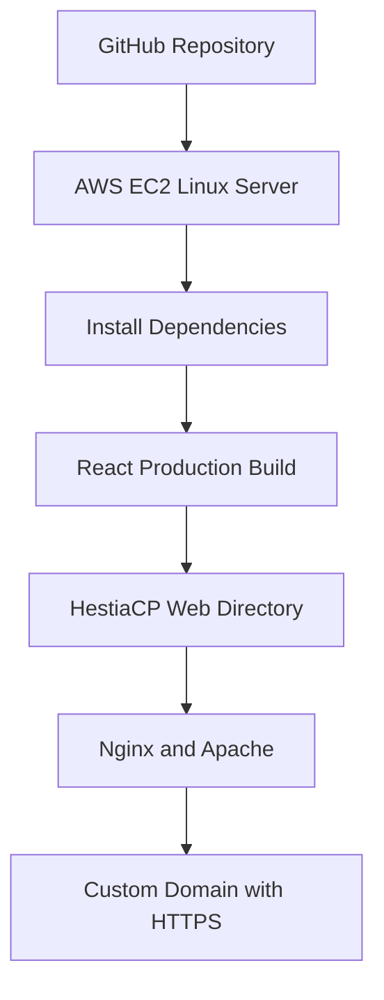

# Nabil Ajwad Rosedi — Developer Portfolio

A modern, responsive developer portfolio showcasing my professional experience, technical skills, certifications, open-source projects, and software engineering journey.

The portfolio presents my experience across AI, full-stack development, mobile applications, fintech, cloud infrastructure, and Web3.

[Live Portfolio](https://mybc.tech) ·
[GitHub](https://github.com/cruzerblade95) ·
[LinkedIn](https://www.linkedin.com/in/nabil-ajwad-rosedi-4bbb621a2/)

---

## About Me

I am a Senior Software Engineer with more than five years of experience building and maintaining production-ready web, mobile, fintech, cloud, and blockchain applications.

My core technologies include:

- Flutter and Dart
- Laravel and PHP
- React and Next.js
- JavaScript and TypeScript
- Node.js
- REST APIs
- Firebase
- MySQL and PostgreSQL
- AWS
- Docker and Linux
- Blockchain and Web3 integrations
- AI provider integrations

I have experience across the complete development lifecycle—from gathering requirements and planning architecture to development, testing, deployment, and production maintenance.

---

## Portfolio Features

### Modern Interface

- Premium dark visual design
- Responsive layouts for desktop, tablet, and mobile
- Glass-style navigation
- Gradient typography and visual accents
- Bento-style capability sections
- Consistent design system across every page

### Animations

- Scroll-triggered content reveals
- Staggered card animations
- Animated hero background
- Interactive particle effects
- Animated gradient text
- Floating hero cards
- Hover elevation and depth
- Scroll progress indicator
- Animated career timeline
- Reduced-motion accessibility support

### Professional Content

- Recruiter-focused introduction
- Technical skills and development tools
- Complete employment timeline
- Certifications and professional learning
- Featured project case studies
- GitHub contribution calendar
- Responsive résumé preview
- Contact and social links

---

## Pages

| Page | Description |
| --- | --- |
| Home | Professional introduction, technology stack, capabilities, metrics, and featured-work call-to-action |
| About | Engineering approach, skills, tools, work experience, certifications, and GitHub contributions |
| Projects | Selected AI, fintech, mobile, enterprise, Web3, and cloud projects |
| Résumé | Downloadable résumé, professional highlights, and responsive PDF preview |

---

## Featured Projects

### AI Client SDK

A TypeScript-first, provider-agnostic AI SDK supporting AWS Bedrock, OpenAI, and Anthropic.

Features include:

- Provider abstraction
- Retry and backoff handling
- Request timeouts
- Streaming responses
- Structured output
- Typed errors
- Automated testing

[Source Code](https://github.com/cruzerblade95/ai-client) ·
[npm Package](https://www.npmjs.com/package/@cruzerblade95/ai-client)

### Web3 AI Portfolio

An AI-powered multi-chain portfolio analytics platform that combines blockchain wallet data with generative AI insights.

Technologies:

- React
- TypeScript
- AWS
- Amazon Bedrock
- Web3

[Source Code](https://github.com/cruzerblade95/web3-ai-portfolio)

### E-DA Wallet

An enterprise e-wallet platform featuring:

- Secure authentication
- Digital wallet management
- QR payments
- Transaction history
- REST API integration
- Mobile-to-backend communication

Technologies:

- Flutter
- Dart
- Laravel
- MySQL
- REST APIs

[Source Code](https://github.com/cruzerblade95/E-DA-User-App) ·
[Case Study](https://mybc.tech/cruzerblade95/portfolio/e-da-wallet/225)

### Penang Smart Kariah

A production Flutter application developed for community and mosque services.

The application integrates with backend APIs and has been published and maintained on:

- Google Play Store
- Apple App Store

### SPB MAINPP

A Laravel-based integrated management system developed for MAINPP.

The system supports organizational workflows through maintainable web modules, structured data, and API-connected services.

[Visit Platform](https://mims.mainpp.gov.my/)

### AWS Portfolio Deployment

This portfolio is deployed on a self-managed AWS EC2 Linux server.

Infrastructure includes:

- AWS EC2
- Ubuntu Linux
- Elastic IP
- HestiaCP
- Nginx
- Apache
- DNS configuration
- Custom domain
- Let’s Encrypt SSL
- HTTPS

---

## Professional Experience

### Senior Software Engineer

**Megah Fintech Sdn. Bhd.**  
January 2025 – June 2026

- Led fintech feature development
- Designed secure payment features and REST APIs
- Integrated blockchain workflows
- Contributed to architecture planning
- Participated in code reviews
- Improved product reliability and maintainability

### Software Engineer

**MyRich Dynasty Networks Sdn. Bhd.**  
February 2023 – December 2024

- Developed Laravel enterprise applications
- Built cross-platform Flutter applications
- Integrated frontend and mobile applications with REST APIs
- Contributed to a React SPA deployed using AWS Amplify
- Used GitHub-based CI/CD workflows
- Improved existing application features and usability

### Full-Stack Developer

**AdEasy**  
March 2022 – September 2022

- Participated in sprint planning
- Gathered business and departmental requirements
- Developed and tested website improvements
- Refined application features through iterative delivery

### Programmer

**PocketData (M) Sdn. Bhd.**  
December 2020 – February 2022

- Participated in daily Scrum meetings
- Analyzed user requirements
- Developed and maintained application features
- Tested and improved existing code
- Collaborated with team members on software delivery

---

## Technical Skills

### Mobile Development

- Flutter
- Dart
- Firebase
- REST API integration
- Google Play Store deployment
- Apple App Store deployment

### Frontend Development

- React
- Next.js
- JavaScript
- TypeScript
- HTML5
- CSS3
- Bootstrap
- Responsive web design

### Backend Development

- Laravel
- PHP
- Node.js
- REST API development
- JWT and OAuth authentication
- Third-party API integration
- Payment gateway integration
- Microservices architecture

### Databases

- MySQL
- PostgreSQL
- Firebase Firestore
- Database design and optimization

### Cloud and DevOps

- AWS Amplify
- AWS EC2
- AWS S3
- Amazon Bedrock
- GitHub Actions
- Docker
- Git
- Linux
- Nginx
- Apache
- HestiaCP
- cPanel
- WHM
- Plesk

### AI Development

- AWS Bedrock
- OpenAI API
- Anthropic API
- AI provider integrations
- Structured AI responses
- AI SDK development
- Retry and timeout handling

### Blockchain and Web3

- Web3 integrations
- Blockchain wallet integrations
- Smart-contract interactions
- Solidity
- Token and transaction workflows

---

## Certifications

- AWS Cloud Practitioner Essentials
- End User Computing on AWS — Advanced Topics
- CCNA Routing and Switching
- Designing RESTful APIs
- Flutter Essential Training
- Database Design Fundamentals
- Git Workflows
- Building a Website with Laravel, React.js, and Inertia
- Creating a Responsive Web Experience
- Learning PHP: Building Dynamic Websites

---

## Technology Stack

### Application

- React 17
- React Router
- React Bootstrap
- React Icons
- React PDF
- React Activity Calendar
- React tsparticles
- Typewriter Effect

### Styling and Animation

- Custom CSS design system
- CSS variables
- CSS Grid
- Flexbox
- CSS keyframe animations
- Intersection Observer API
- Responsive media queries
- Reduced-motion accessibility

### Testing and Build

- Jest
- React Testing Library
- Create React App
- npm

---

## Project Structure

```text
src/
├── Assets/
├── components/
│   ├── About/
│   │   ├── About.js
│   │   ├── Github.js
│   │   ├── Techstack.js
│   │   └── Toolstack.js
│   ├── Home/
│   │   ├── Home.js
│   │   ├── Home2.js
│   │   └── Type.js
│   ├── Projects/
│   │   ├── ProjectCards.js
│   │   └── Projects.js
│   ├── Resume/
│   │   └── ResumeNew.js
│   ├── Footer.js
│   ├── Navbar.js
│   ├── Particle.js
│   ├── Pre.js
│   ├── Reveal.js
│   ├── ScrollProgress.js
│   └── ScrollToTop.js
├── App.js
├── App.css
├── App.test.js
├── index.css
├── index.js
├── setupTests.js
└── style.css
```

---

## Local Development

Clone the repository:

```bash
git clone https://github.com/cruzerblade95/cruzerblade95_portfolio.git
```

Open the project:

```bash
cd cruzerblade95_portfolio
```

Install dependencies:

```bash
npm install
```

Start the development server:

```bash
npm start
```

The application will be available at:

```text
http://localhost:3000
```

---

## Testing

Run the automated tests:

```bash
npm test -- --watchAll=false
```

Expected result:

```text
Test Suites: 1 passed, 1 total
Tests:       1 passed, 1 total
```

---

## Production Build

Create an optimized production build:

```bash
npm run build
```

The generated production files will be available inside:

```text
build/
```

---

## Deployment Architecture



Typical deployment commands:

```bash
git pull origin master
npm install
npm test -- --watchAll=false
npm run build
```

The generated files from `build/` are then published to the HestiaCP web directory.

---

## Upcoming Features

The following improvements are planned for future versions of this portfolio.

### Priority 1 — Project Case Studies

- [ ] Add a dedicated page for every major project
- [ ] Explain the business problem for each project
- [ ] Document my responsibilities and technical decisions
- [ ] Add system architecture diagrams
- [ ] Describe engineering challenges and solutions
- [ ] Add measurable project outcomes
- [ ] Include screenshots and application demonstrations

### Priority 2 — Contact System

- [ ] Add a professional contact form
- [ ] Implement client-side validation
- [ ] Connect the form to a secure backend API
- [ ] Add spam protection
- [ ] Display submission success and error states
- [ ] Send email notifications for new enquiries

### Priority 3 — Blog and Technical Writing

- [ ] Add a technical blog section
- [ ] Publish articles about Flutter and Laravel
- [ ] Write about building the AI Client SDK
- [ ] Document AWS deployment tutorials
- [ ] Share Web3 integration lessons
- [ ] Add categories, tags, and article search

### Priority 4 — Performance and SEO

- [ ] Add a custom Open Graph preview image
- [ ] Add structured data using JSON-LD
- [ ] Generate a sitemap
- [ ] Improve page-level metadata
- [ ] Add lazy loading for heavy components
- [ ] Optimize images and assets
- [ ] Reduce the initial JavaScript bundle
- [ ] Improve Core Web Vitals
- [ ] Run Lighthouse performance audits

### Priority 5 — Automated Deployment

- [ ] Add GitHub Actions for testing
- [ ] Run production builds automatically
- [ ] Deploy successful builds to AWS EC2
- [ ] Add deployment rollback support
- [ ] Add separate development and production environments
- [ ] Add automated dependency security checks

### Priority 6 — Testing

- [ ] Add tests for every page
- [ ] Add navigation tests
- [ ] Add project-card tests
- [ ] Add contact-form tests
- [ ] Add accessibility tests
- [ ] Add end-to-end tests
- [ ] Test desktop, tablet, and mobile layouts

### Priority 7 — Accessibility

- [ ] Add a skip-to-content link
- [ ] Improve keyboard navigation
- [ ] Review color contrast
- [ ] Improve screen-reader labels
- [ ] Add visible focus indicators
- [ ] Test with accessibility auditing tools

### Priority 8 — User Experience

- [ ] Add project filtering by technology
- [ ] Add project search
- [ ] Add dark and light theme switching
- [ ] Save the selected theme locally
- [ ] Add animated page transitions
- [ ] Add a back-to-top button
- [ ] Add a command-menu navigation shortcut
- [ ] Improve résumé downloading on mobile

### Priority 9 — Analytics and Monitoring

- [ ] Add privacy-friendly visitor analytics
- [ ] Track project-link interactions
- [ ] Monitor JavaScript errors
- [ ] Add website uptime monitoring
- [ ] Add performance monitoring
- [ ] Create an analytics dashboard

### Priority 10 — Architecture Modernization

- [ ] Upgrade React and supporting libraries
- [ ] Replace deprecated packages
- [ ] Migrate from Create React App to Vite or Next.js
- [ ] Introduce reusable content configuration
- [ ] Move project information into structured data files
- [ ] Add TypeScript across the portfolio
- [ ] Add ESLint and Prettier
- [ ] Add a reusable component documentation system

---

## Suggested Development Roadmap

### Version 1.1

- Dedicated project case-study pages
- Better project screenshots
- Project filtering
- Improved SEO metadata

### Version 1.2

- Contact form with backend API
- Spam protection
- Email notifications
- Form validation and status messages

### Version 1.3

- Technical blog
- Article categories
- Article search
- Social-sharing metadata

### Version 2.0

- Migration to TypeScript
- Migration from Create React App
- Automated testing and deployment
- Improved performance and analytics
- Optional light theme

---

## Contributing

This is a personal portfolio project, but suggestions and constructive feedback are welcome.

If you find a technical issue, open a GitHub issue with:

- A clear description
- Steps to reproduce
- Expected behavior
- Actual behavior
- Browser and device information

---

## Contact

- Email: [nabilajwad10@gmail.com](mailto:nabilajwad10@gmail.com)
- GitHub: [cruzerblade95](https://github.com/cruzerblade95)
- LinkedIn: [nabil-ajwad-rosedi](https://www.linkedin.com/in/nabil-ajwad-rosedi-4bbb621a2/)
- Portfolio: [mybc.tech](https://mybc.tech)

---

## License

This repository contains personal portfolio content.

Please contact me before reusing personal information, branding, résumé content, or project descriptions.